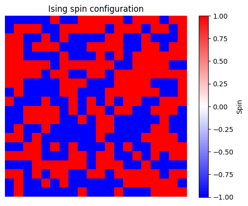
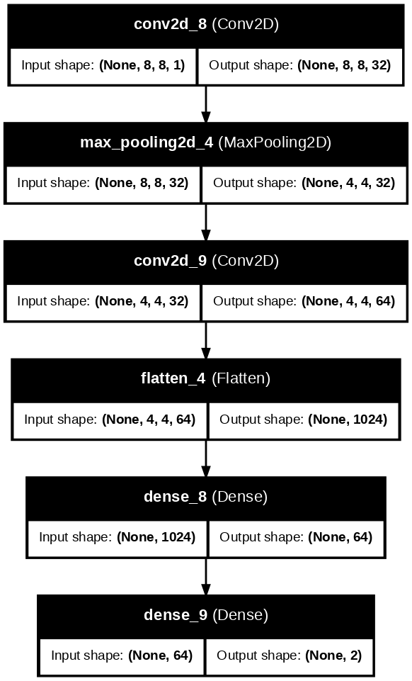
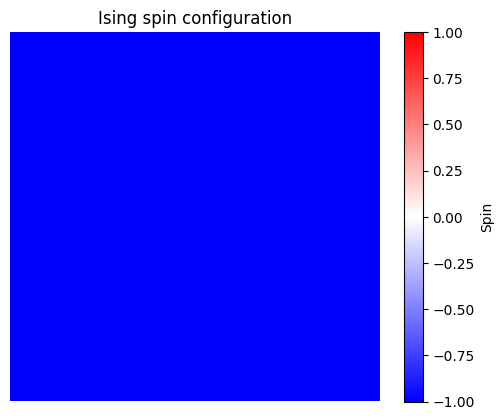
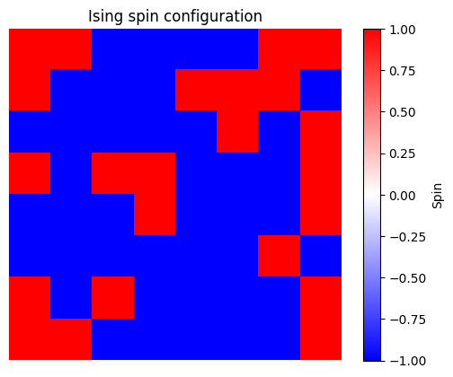
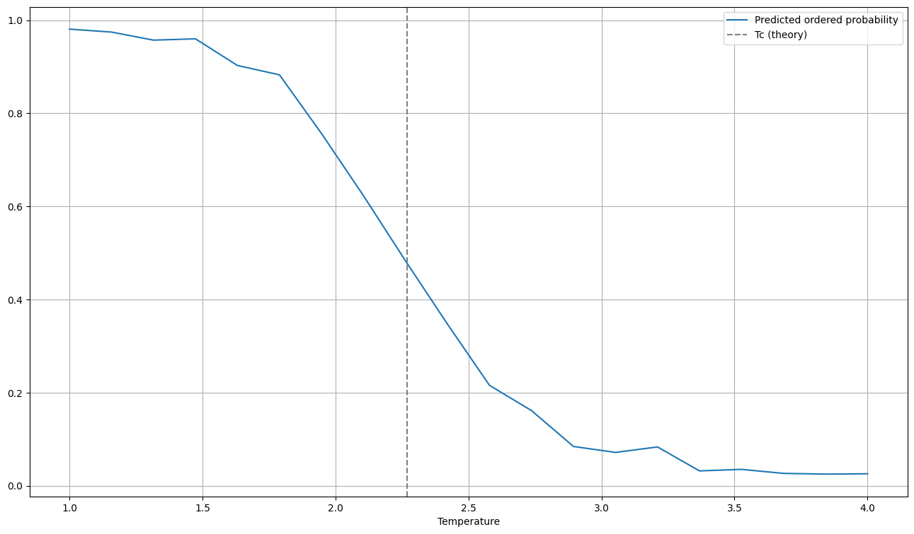

# Ising Phase Classifier: CNN-based 2D Ising Model Phase Detection

This project demonstrates a simple convolutional neural network (CNN) to classify spin configurations of the 2D Ising model into **ordered (low-temperature)** and **disordered (high-temperature)** phases based only on visual spin patterns.

  
  

---

## Try it in Google Colab

> You can generate spin configurations at various temperatures and let the model predict the phase!

---

## Repository Contents

| File | Description |
|------|-------------|
| `isingclassification.py` | Contains Ising model simulation (Metropolis method) and model definition |
| `model.h5` | Pretrained model (can be trained in Colab too) |
| `demo.ipynb` | Google Colab-compatible notebook for demonstration |
| `images/` | Sample spin images and output graphs |
| `requirements.txt` | Library dependencies (not needed in Colab) |

---

## Example Output

### Spin Configurations

At low and high temperatures:

  
  

### Model Prediction across Temperatures

  

---

## Technologies Used

- Python (NumPy, Matplotlib)
- TensorFlow / Keras
- Google Colab

---

## Notes

- The model is trained in a **supervised** fashion using temperature-based labels.
- Future work may include **unsupervised detection of the phase transition** using clustering or dimensionality reduction.
- Created by Ushihara as a side project for learning and exploration.
